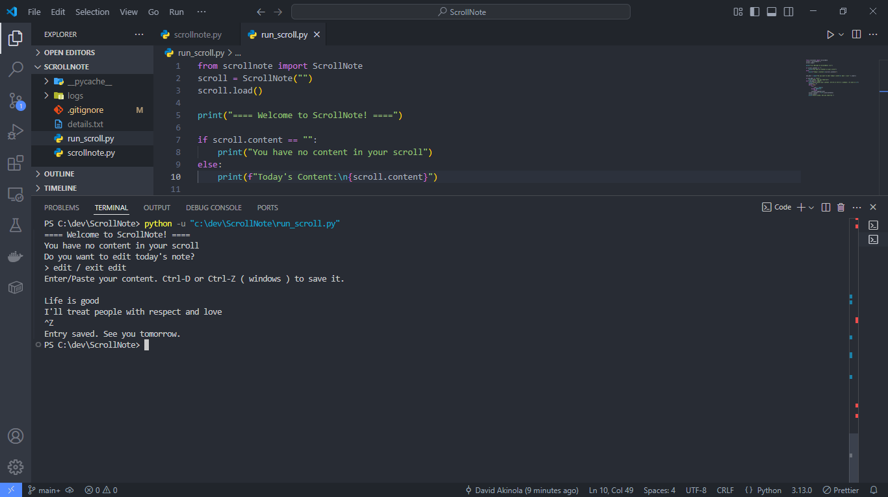

<p align="center">
  
</p>

<h1 align="center">ScrollNote</h1>

A minimalist, terminal-based daily logging tool.  
One note per day. Saved locally. Yours forever.

---

##  Features

ScrollNote is a simple tool to help you write logs daily — stored as `.txt` files by date.

- Opens today’s note automatically
- Loads your previous entry (if any)
- Lets you edit in the terminal
- Saves as `logs/YYYY-MM-DD.txt`

---

## Screenshot

<p align="center">
  
</p>

## Installation

###  Requirements
- Python 3.8 or higher

###  Install

Clone the repo:

```bash
git clone https://github.com/yourusername/scrollnote.git
cd scrollnote
